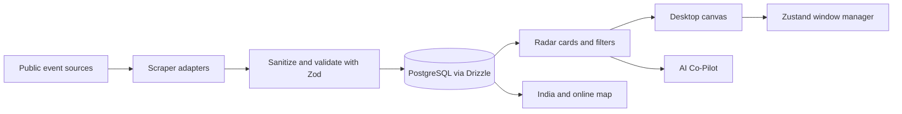

# Contributing to Hack OS

Welcome to Hack OS, the DeScience Open Source Club's student-built hackathon directory and browser desktop. You can contribute a small UI improvement, a data adapter, an accessibility fix, or a complete mini-app. This guide helps you run the project, understand its boundaries, and submit a change that is easy to review.

## What we are building

Hack OS combines an interactive desktop with hackathon discovery, maps, source ingestion, and an AI project mentor. Shared Zod contracts guard data as it moves from external event listings into the directory and on to the interface.



| Area | Main tools | Contribution boundary |
| --- | --- | --- |
| Desktop shell | React, Tailwind CSS, Framer Motion, Zustand | Window lifecycle and app registration |
| Directory and map | shared `Hackathon` contract, Leaflet | Features under `src/components/apps/radar/` and `src/components/apps/map/` |
| Ingestion | `fetch`, Cheerio, Zod, Drizzle | Source adapters return untrusted `RawHackathonData`; sanitizer owns database input |
| AI Co-Pilot | Vercel AI SDK, JarvisLabs-hosted Ollama, Zod | API routes validate inputs and outputs; endpoint settings stay server-side |
| Verification | Vitest, React Testing Library, Playwright, Biome | Tests and automated checks run before merge |

The directory currently includes illustrative sample events. Confirm real deadlines and eligibility on official event pages; do not present fixtures as live listings.

## Five-minute local setup

Use Node.js 22.18 or newer, pnpm, Docker Desktop, and the Supabase CLI. The local Supabase stack requires Docker to be installed and available on your shell `PATH`.

1. Copy the repository's clone URL from GitHub's **Code** menu. In the terminal, type `git clone `, paste the URL, and press Enter. Then enter the cloned project directory:

   ```bash
   cd hack-os
   ```

2. Check the tools and install the locked dependencies:

   ```bash
   node --version
   pnpm --version
   docker --version
   pnpm install --frozen-lockfile
   ```

3. Create a private local environment file and start Supabase:

   ```bash
   cp .env.example .env.local
   pnpm dlx supabase start
   ```

   Copy the local database URL, Supabase URL, and anon key printed by the CLI into the matching fields in `.env.local`. Keep this file untracked. Configure the three JarvisLabs Ollama settings in `.env.local` to use the AI features; the desktop, Radar, and test suite work without them. Google and Groq are disabled for this test project.

4. Apply the local database migration and run the app:

   ```bash
   pnpm dlx supabase db reset
   pnpm dev
   ```

   Open `http://localhost:3000`. Stop the server with **Ctrl+C**. If port 3000 is already in use, stop the other local server or choose an available port.

## Build and register a desktop mini-app

1. Create the app component under `src/components/apps/<app-name>/`. Keep window chrome, focus, and drag state in the OS shell; mini-apps own their content and feature-specific state.
2. Add an entry to `APP_REGISTRY` in `src/stores/useWindowManager.ts`. The key determines the typed `AppKey`; set a concise title, icon identifier, and sensible default window dimensions.
3. Add the icon to the `APPLICATIONS` list in `src/components/os/Dock.tsx` and the desktop shortcut list in `src/components/os/Desktop.tsx` when the app should appear in both places.
4. Add an exhaustive renderer case in `AppContent` in `src/components/os/Desktop.tsx`.
5. If users should find the app with **⌘K / Ctrl+K**, add a command to `src/components/os/CommandPalette.tsx`.
6. Add a store or component test for any behavior with state, keyboard input, or a data boundary. Use accessible labels so tests and keyboard users can find controls reliably.

Example component shape:

```tsx
"use client";

export function MyApp() {
  return (
    <section aria-labelledby="my-app-title" className="h-full overflow-auto p-4">
      <h1 id="my-app-title">My mini-app</h1>
      <p>Keep this view focused on one useful student task.</p>
    </section>
  );
}
```

## Add a hackathon scraper

Adapters live in `src/lib/scrapers/`. Read the source's public listing pages, RSS, or documented interface; do not reverse engineer undocumented APIs or bypass access controls. Keep requests polite and limited, and never scrape personal data.

1. Add a source value to the canonical source enum in `src/types/hackathon.ts`, then update `ScraperName` and `HACKATHON_SCRAPER_SOURCES` in `src/lib/scrapers/types.ts`.
2. Implement a class under `src/lib/scrapers/` that extends `BaseScraper`. Set `name` and implement `scrape(): Promise<RawHackathonData[]>`. Reuse the inherited `fetchText` and listing pagination helpers rather than calling remote hosts from browser code.
3. Map only facts present on the source page into `RawHackathonData`. Preserve the original event URL and stable source ID. Leave missing dates, prize values, and restrictions missing; never guess them.
4. Register the adapter in `src/lib/scrapers/syncEngine.ts` and include the source in the CLI/cron allowlist.
5. Add saved HTML/JSON fixtures and integration tests for valid, incomplete, malformed, and out-of-scope records. Assert the sanitizer either returns a schema-valid insert or skips the record.
6. Run a small local sync and review logs before scheduling it. New events remain unverified until a moderator checks the official page.

The student directory includes online events and physical events in India. A new adapter must not silently broaden that scope.

## Run checks before opening a pull request

```bash
pnpm lint
pnpm format:check
pnpm typecheck
pnpm test
pnpm test:coverage
pnpm build
pnpm test:e2e
```

`pnpm test:e2e` starts a production build locally when no server is already listening on port 3000. The first Playwright run may need `pnpm exec playwright install chromium` to download the browser.

## Branch, commit, and pull request protocol

- Branch names use `feature/issue-number-short-description`, `fix/issue-number-short-description`, or `docs/issue-number-short-description`; use the issue number when one exists.
- Commit subjects use Conventional Commit prefixes: `feat:`, `fix:`, `docs:`, `test:`, or `chore:`. Keep the first line specific and concise.
- Open a pull request against `main`, link its issue, explain the user impact, and include before/after screenshots or a short recording for visible UI changes.
- Check the self-review boxes in the pull request template. Do not include `.env.local`, provider tokens, service-role keys, or user data in commits, screenshots, fixtures, or logs.
- CI runs format/lint and TypeScript checks, unit and integration tests with a coverage summary, the Playwright desktop smoke test, and the pull request title check. Address failures before requesting review.
- Ask for review when the change is ready. Keep pull requests narrow enough that a student maintainer can understand and verify them.

## How to learn from the code

Start at the feature boundary, then follow one record or user action through each layer. For a scraper, trace `RawHackathonData` → `sanitizeHackathon` → `HackathonInsert`. For a mini-app, trace its dock command → `APP_REGISTRY` → `Desktop` renderer → `WindowFrame`. Read the tests beside the implementation: they document expected behavior and give you a safe place to experiment.
